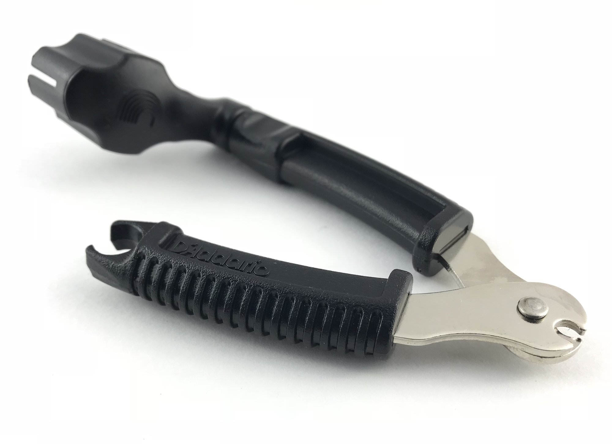
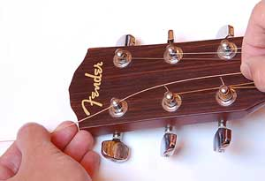
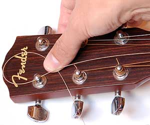
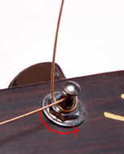

# Change a guitar string

## Steps
1. Place your guitar on a clean, flat surface. You may want to use a towel or work mat under the body of your instrument to avoid scratching it. 
2. Start by removing the 6th string (or low E in **Standard Tuning**).

 **Note:** Avoid removing all of the strings at once. This can affect the tension on the neck of the guitar and may require you to adjust the intonation. 

3. Secure the 6th string to the bridge on your guitar. If you are changing the strings on an acoustic guitar, this may require you to remove the bridge pin with a bridge pin puller.

 **Note:** Avoid using pliers to remove the bridge pins on acoustic instruments as this pay damage or scratch them. 

4. Turn the tuning peg so the holes are vertical and thread your string through the hole.  

  

5. Feed the string through the tuning peg until there is about an inch of space between the string and the neck of the guitar when you pull up on the string.  
6. Bend the string into a small loop and feed it underneath itself near the hole on the tuning peg.

    

7. Make a sharp bend upward in the string and pull the end upward while you turn the tuning peg clockwise. Tune the string to the correct pitch.

    
 
8. Stretch the string by pulling upwards on it while fretting each fret on the neck. Re-tune the string to the correct pitch.
9. Trim off the excess part of the string near the tuning peg hole.
10.  Repeat this process one a time for the remaining five strings.
