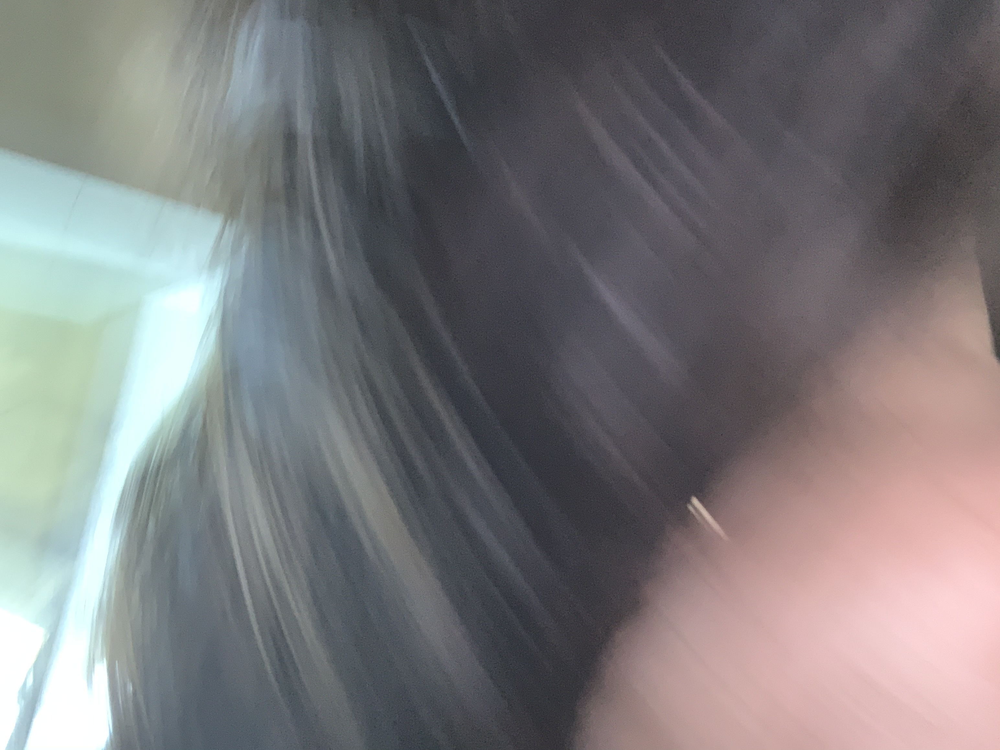

# How to wash hair

To wash hair, follow this procedure. 
1. Wet hair thoroughly.
- We're in a drought. Don't use too much water.   
- But then again, you need to wet it.   
2. Squeeze shampoo on your hand. Amount varies on the volume of your hair. 
For a quick reference, see [FYI](#fyi) below.
3. Lather shampoo into hair. Don't forget to wash ears also while you have the suds. Earlobe hygiene is important as you get older. Wash behind ear as well.    
**Note:** Do not open eyes. They'll _burn_.
4. Massage scalp vigorously for a minute.
5. Blow your nose.
6. Rinse with water.
7. Dry with a towel.

## Good example

This is how your hair should look afterward:
 

## FYI

| Hair length | Hair volume | Suggested shampoo amount |
|-------------|-------------|--------------------------|
| Zero        | None        | Use body wash            |
| Short       | Small       | 15ml                     |
| Short       | Full        | 20ml                     |
| Medium      | Medium      | 25ml                     |
| Long        | Small       | 30ml                     |
| Long        | Full        | 40ml                     |

