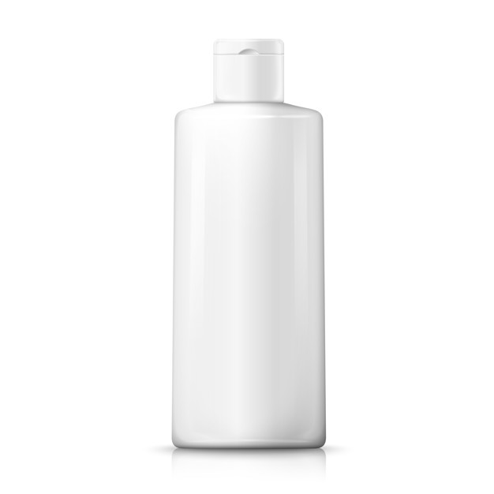

This shampoo procedure is a complete how-to instructional guide to your hair-care hygiene routine. In order to use your shampoo to clean your hair, follow the steps provided closely and carefully.

1. Thoroughly wet your hair.
2. Lather a quarter size amount of shampoo in your palms and then work into your roots. You don't need to shampoo the tips of your hair.
3. Rinse out all of the shampoo.
4. Apply conditioner, concentrating on the ends.
5. Rinse with cold water.
6. Repeat steps 1 through 5 as desired.

When you finish shampooing, verify that your hair is shiny and clean. Enjoy!
