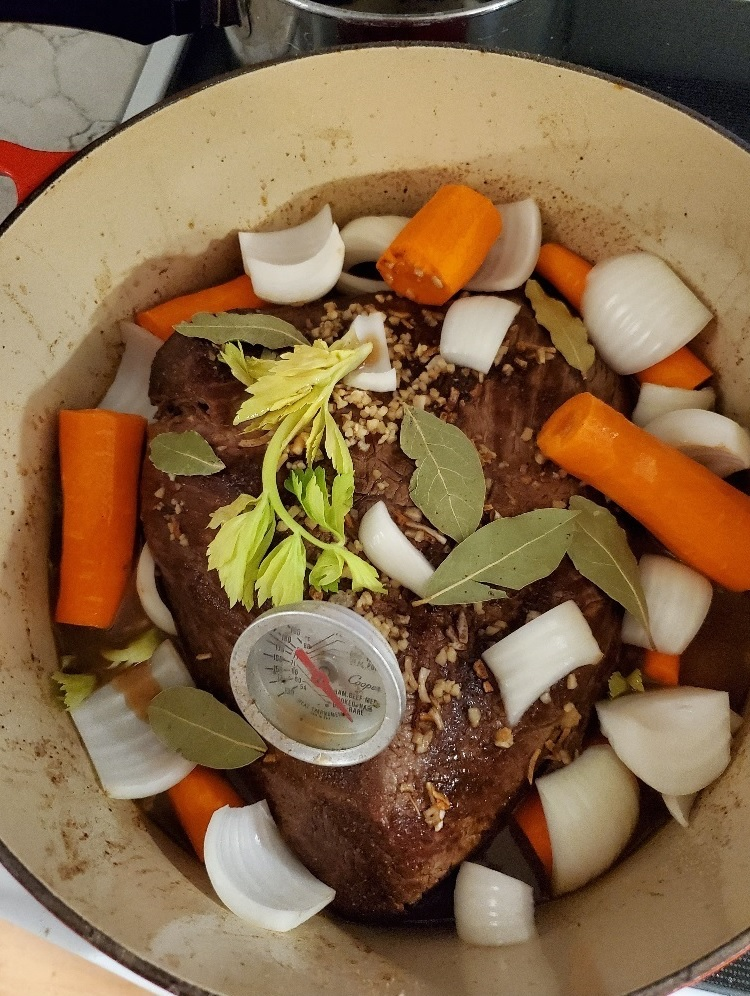

# How to Make Gravy

## Ingredients
* 3 lb shoulder roast
* 1/2 pound carrots
* Onion
* celery
* red wine
* worcestershire sauce
* balsamic vinegar
* Crystal hot sauce
* olive oil
* Sea Salt
* canola oil
* Black pepper
* garlic powder
* bay leaves
* Fine flour
* Beef stock
* 1 stick Butter

## Procedure: Cook Shoulder Roast
1. Wash raw roast in cold water and blot dry.
2. Sear all sides in hot pan with canola oil.
3. Let cool and place in roasting pot or Dutch oven, fat side up.
4. Add red wine, worcestershire sauce, balsamic vinegar, beef stock and Crystal hot sauce.
5. Rub with olive oil, sea salt, garlic powder and black pepper.
6. Surround with peeled carrots, onion sections, and leafy celery stalks.
7. Insert meat thermometer and roast at 275F for three hours.
8. When done, remove meat from roasting pot to let rest.

## Procedure: Make Beef Roast Gravy
1. Strain contents of roasting pot into a saucier pan.
2. Remove 1 cup of liquid from saucier pan and set aside to cool.
3. Place saucier pan under low heat and add 8 oz beef stock.
4. Melt 1 stick of butter, and add to saucier pan when liquid is hot.
5. Add 1/2 cup of fine flour (Wondra) to cup of cooled liquid while whisking to avoid lumps.
6. Continue whisking liquid in saucier pan, and add in cooled liquid with flour a portion at a time.
7. Add black pepper to liquid and whisk in.
8. Raise and lower heat as needed to keep liquid slowly bubbling.
9. Whisk liquid in saucier pan for 45 minutes - 1 hour, until liquid becomes thick with a silky sheen.

