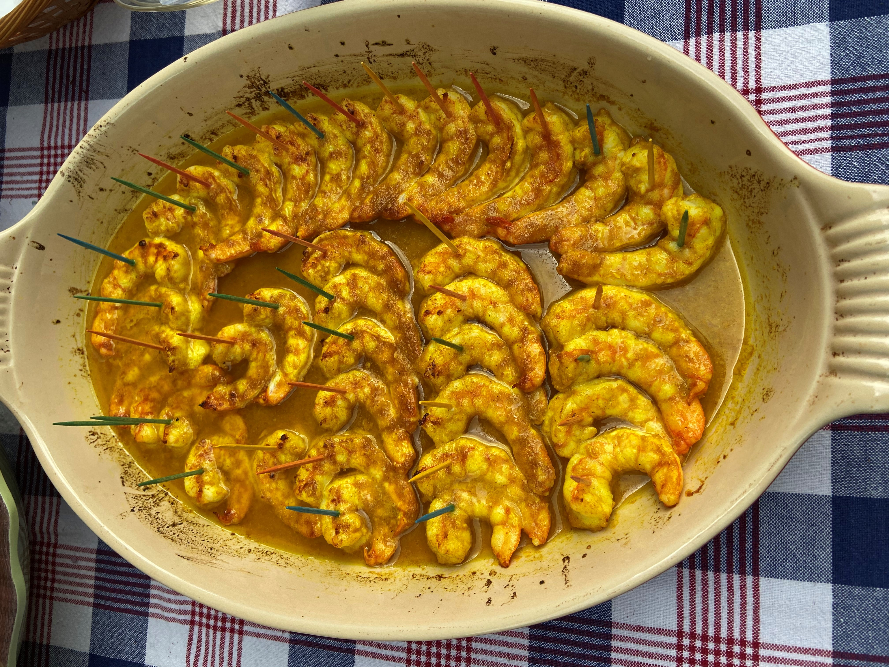

# Florence Fabricant's Grilled Cumin Shrimp

About this recipe1, Florence said, "When food was becoming my passion and was not yet my profession, my husband had a client in his law practice who gave him a sheaf of typewritten recipes. This was one of them. It has never failed to garner praise."
## Ingredients
	+ 8 tablespoons (1 stock) unsalted butter
	+ 2 teaspoons ground turmeric
	+ 1 1/2 teaspoons ground cumin
	+ 1 teaspoon ground coriander
	+ Juice of 2 lemons
	+ 2 pounds of large shrimp, shelled and deveined
## Instructions
1. Preheat the broiler.
2. Melt the butter in a saucepan. Stir in the turmeric, cumin, coriander, salt, and lemon juice.
3. Arrange the shrimp in a single layer in a shallow broiling pan. Spread the butter mixture over them.
4. Broil under high heat until the shrimp are glazed and golden brown, about 8 minutes. Skewer with toothpicks and serve immediately.

Serves 12 hor's d'oevres

1 The New Basics Cookbook by Julee Rosso & Sheila Lukins, Workman Publishing Company (January 10, 1989)
